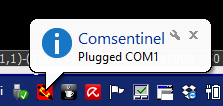
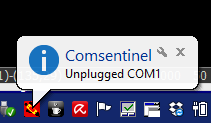
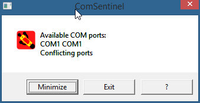

License: GPL

The problem
-----------

__ComSentinel__ is a tool to solve a problem that frequently happens on Windows
when using many USB -> Serial interfaces, e.g. when many **Arduino boards** are used in the same project.

Due to a not-so-intuitive way Windows assigns com port numbers, it happens that two 
Arduino's get the same conflicting COM line, for instance two COM2's. This
is a frequent reason of malfunctioning.

Moreover, once plugged knowing which COM port has been allocated is not easy
in fact opening the device list and browse the device tree is a time consuming task.

The solution
------------
**The executable can be loaded from [here](https://github.com/fjovine/ComSentinel/blob/master/lcc/comsentinel.exe): pushbutton 'raw'.**

Launch **ComSentinel** to open a dialog box showing all the available COM ports.

The Minimize button, closes the dialog but the application keeps running behind
an icon on the windows taskbar.

The ? button shows the Windows system device dialog to change the settings of each COM port.

Once running, click on the taskbar icon to reopen the dialog box and exit the application
if needed.

While silently running in the [Taskbar Notification Area](http://en.wikipedia.org/wiki/Taskbar)
it receives messages from the OS dealing with changes in the device configuration
and it checks if new COM interfaces appeared or disappeared or if
conflicting COM's have been plugged.

**COM1** has been plugged 

**COM1** has been unplugged 

A conflicting USB/Serial interface with **COM1** has been plugged and it conflicts
with another COM port.

The dialog box when a conflict state is found.

Technical Info
--------------

This tool is written in C under WIN32 api. It does not need any installation and is pretty small.

It has been compiled with the LCC compiler (32 bit vesion) that can be downloaded from [here](http://www.cs.virginia.edu/~lcc-win32/).

Some macro definitions are missing from the include files of the LCC compiler (2012 edition) and have been added
to local includes.
